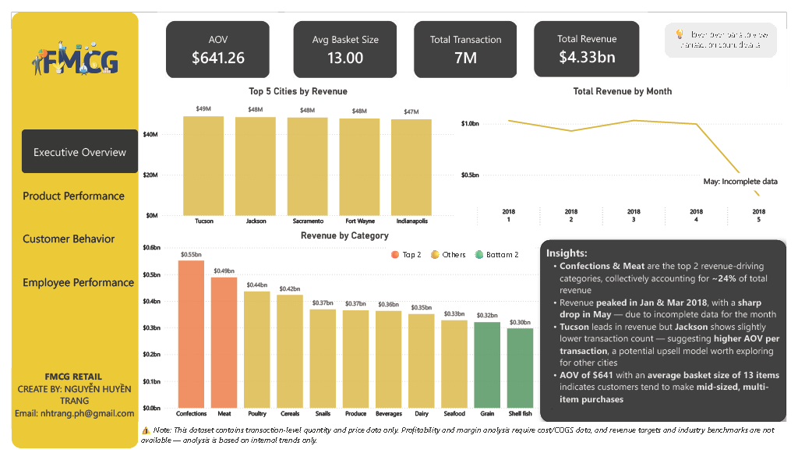
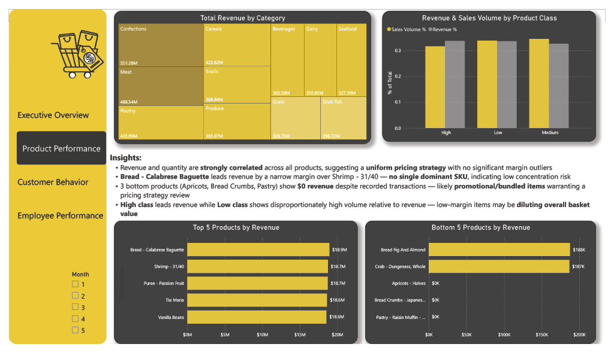
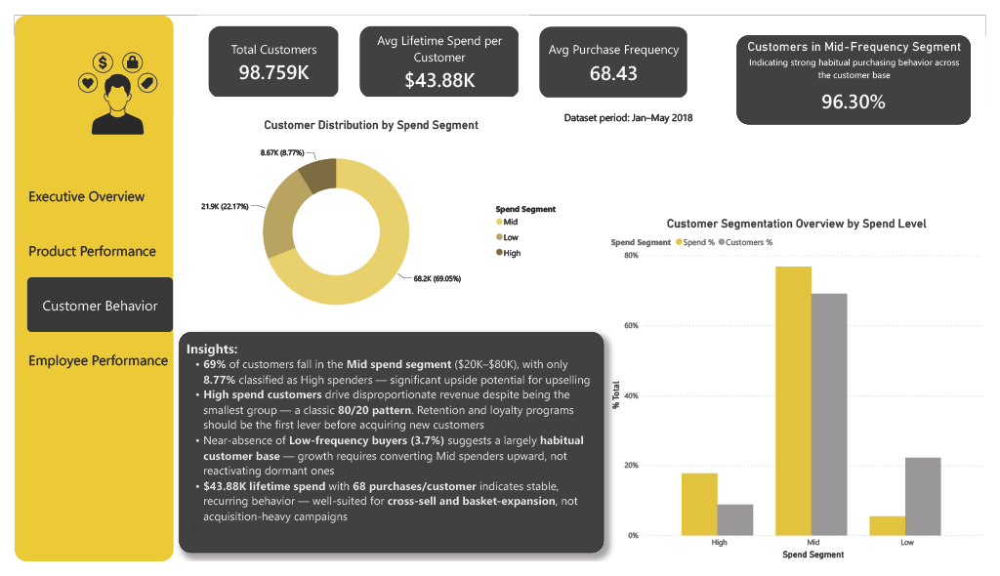
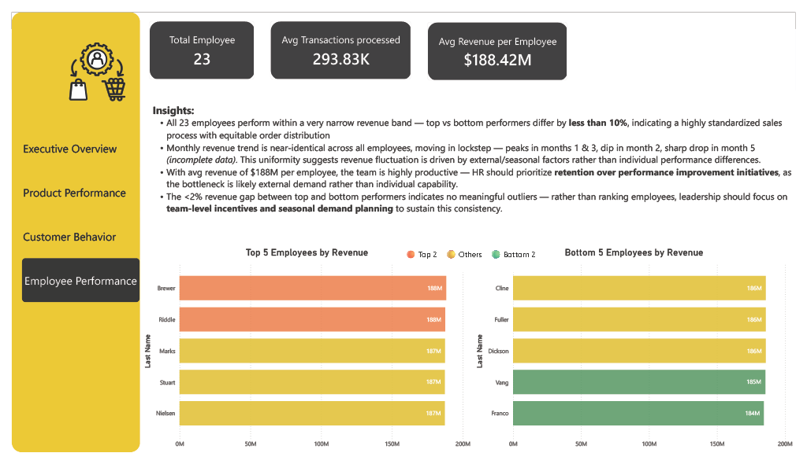

# FMCG Retail Analytics Dashboard

FMCG retail analytics dashboard built with Power BI and MySQL — analyzing 6.76M+ transactions across product, customer, and employee performance.

## Overview
This project analyzes a large-scale synthetic FMCG retail dataset (Jan–May 2018) to uncover revenue drivers, customer segmentation patterns, and employee performance trends. The backend was built in MySQL with custom queries, then visualized in a 4-page interactive Power BI dashboard.

## Business Questions
- Which categories and cities drive the most revenue?
- How are customers segmented by spend and purchase frequency?
- Is employee performance consistent across the team?
- What products underperform and why?

## Tools & Skills
- **MySQL**: Schema design, CTEs, window functions, JOINs across 6.76M+ rows
- **Power BI**: DAX measures, Power Query transformations, multi-page navigation
- **Data Storytelling**: Insight writing with SO WHAT / NOW WHAT framing

## Dashboard Preview

### Executive Overview

### Product Performance

### Customer Behavior

### Employee Performance

## Key Insights
- Confections & Meat are the top 2 revenue-driving categories (~24% of total revenue)
- High-spend customers (8.77% of base) show a classic 80/20 revenue concentration pattern
- Employee performance is highly uniform (<10% gap between top and bottom), suggesting external demand drives revenue fluctuation more than individual capability
- 3 SKUs show $0 revenue despite recorded transactions — likely promotional/bundled items

## Data Notes
This dataset contains transaction-level quantity and price data only. Profitability and margin analysis require cost/COGS data, which is not available. Revenue targets and industry benchmarks are also not available — analysis is based on internal trends only.

## Files
- `FMCG RETAIL.pbix` — Power BI dashboard file
- `FMCG RETAIL.pdf` — Full dashboard export
- `SQL scripts/` — Database setup and analysis queries
